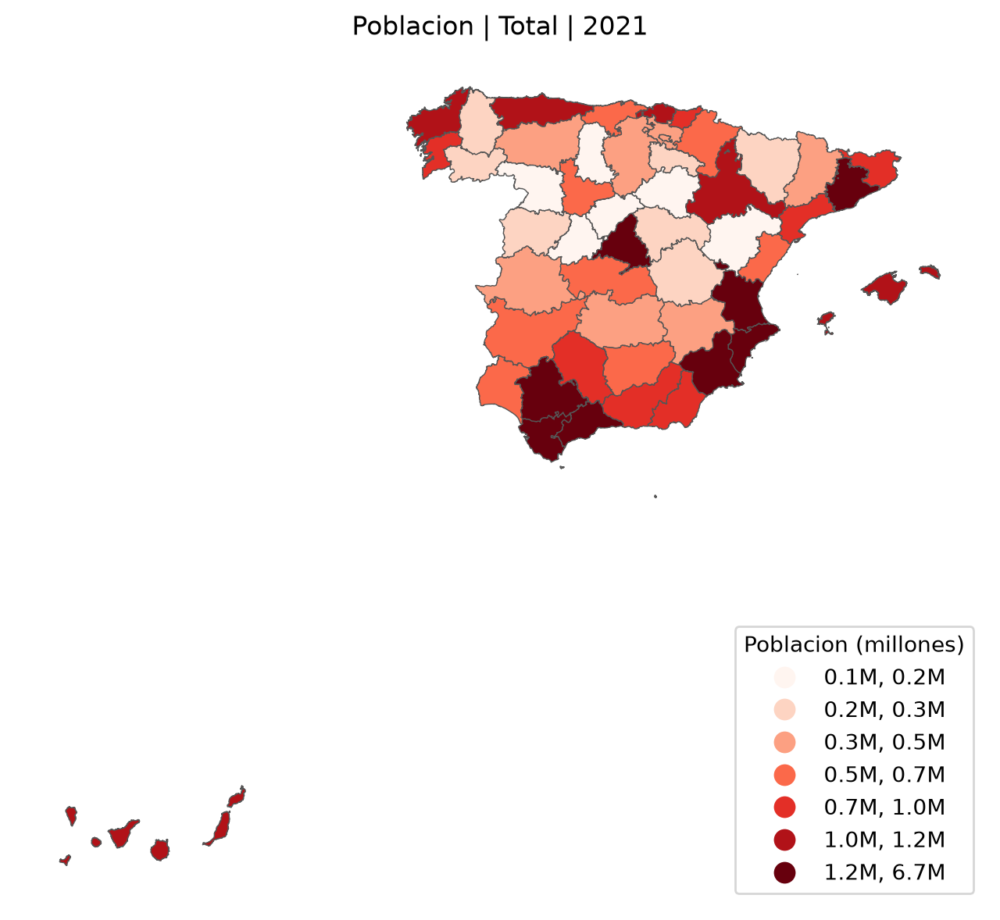
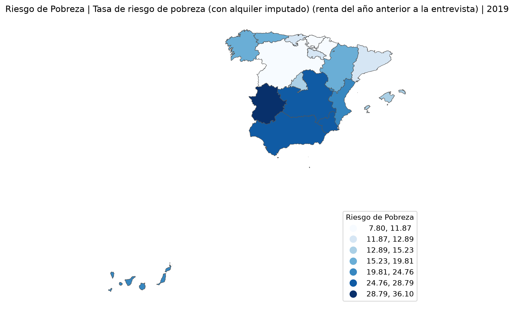

# UnderMaps
A partir de mapas GeoJSON, y bases de datos del INE, indicándole el mapa a utilizar y la base de datos a utilizar, con el uso de GeoPandas generación de mapas de España con representación de datos ya sea divididos por CCAA o provincias.

